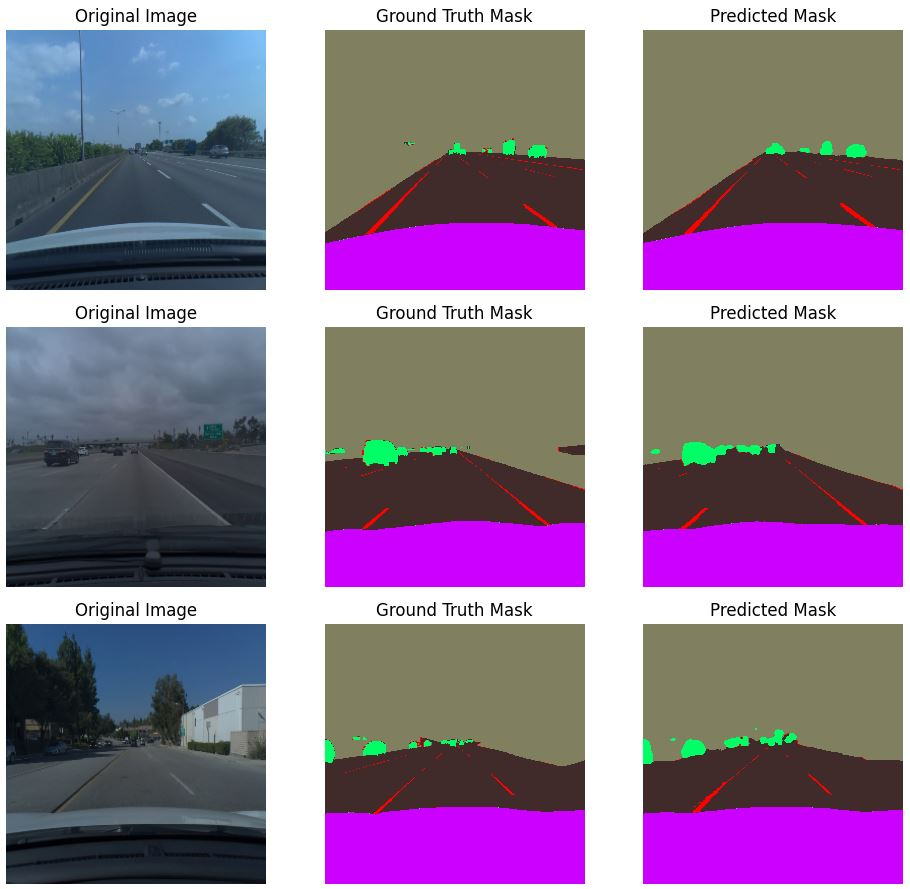

# Road Segmentation with UNet

This repository contains code for training and evaluating a UNet-based segmentation model for road image segmentation task. The model is implemented using the segmentation-models library and is designed to segment images into five classes: Road, Lane, Undrivable, Movable, and Car.

Segmentation Models library was used with Resnet50 backbone and U-Net to achieve better performance. Model was trained for 40 epochs and then converted to tflite model to use on Raspberry Pi.

## Usage

Install necessary packages with sh setup.sh
You may need to change the code depending on your input choice of camera. Also feel free to adjust display_mode, num_threads, enable_edgetpu, camera_id, width, height parameters to find what fits well for you.
